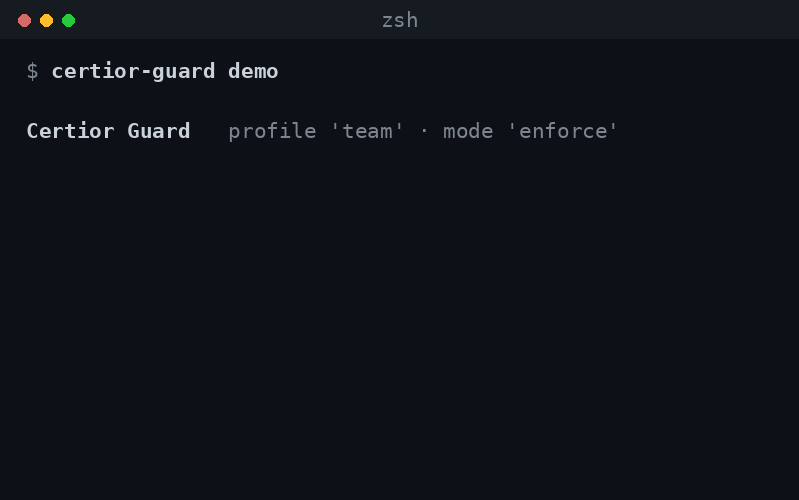

# Certior Guard

You let Claude Code run on its own, and most of the time that is fine. But the
same agent that edits a test can also read your `.env`, pipe a script from the
web into your shell, wipe a directory, or push to prod, and in auto-accept mode
nothing stops it until after it has happened.

Certior Guard is a policy hook that checks every `Bash` / `Edit` / `Read` /
`WebFetch` / MCP call before it runs, and **allows** it, **holds** it for
approval, or **blocks** it, each with a reason and a local receipt. Zero
dependencies, no account.

<p align="center">
  
</p>

## Install

Certior Guard runs as a **Claude Code plugin**, installed straight from this
repository. It is free and self-hosted: no npm package, no account, and no
marketplace fee. All it needs is Node, which Claude Code already uses.

```
/plugin marketplace add certior/certior-guard
/plugin install certior-guard@certior
```

That is the whole install. The plugin is self-contained and applies `team` /
`ask` defaults immediately, so there is no setup step.

Requires Node 18+. If Node is somehow missing, the hook fails open (allows
everything) and warns at session start.

### Manual setup (without the plugin)

Prefer to wire the hook yourself, with no plugin and no npm package? Clone the
repo once and run `init` from the project you want to protect:

```bash
git clone https://github.com/certior/certior-guard ~/certior-guard
cd your-project
node ~/certior-guard/bin/certior-guard.js init   # scan, pick a profile, wire the hook
```

`init` writes three things:

```
certior.yml               # your profile + mode, edit any time, no restart
.claude/settings.json     # the PreToolUse hook (the plugin wires its own)
.certior/audit/           # one JSONL receipt per decision
```

## Why not just Claude Code's built-in permissions?

Claude Code already prompts for permission, Certior adds the parts it doesn't:

- **Curated defaults you don't write.** Ready-made `personal` / `team` / `production` / `regulated` profiles, instead of hand-maintaining allow/deny rules.
- **Resists evasion.** Rules run against a *parsed, normalized* command, so `c""url`, `sudo curl`, `/usr/bin/curl`, `FOO=1 curl` don't slip past, and secret reads via `source .env`, `cp .env /tmp/x`, or `node -e "readFileSync('.env')"` are caught, not just a literal `Read .env`.
- **A tamper-evident audit trail.** Every decision is a hash-chained receipt you can `verify`, a record of what the agent was allowed to do, which a prompt you clicked through never leaves.
- **A checked safety floor.** `certior-guard check` *exhaustively* verifies that secrets, disk wipes, remote-code-exec, and exfiltration can't be allowed by any profile or mode.

It runs **locally, sends nothing anywhere, has zero dependencies, and is Apache-2.0.** It only ever *narrows* what the agent may do, an allowed call proceeds to Claude Code's normal flow untouched.

## Configuration

`certior.yml` holds two values. Changes take effect on the next tool call.

```yaml
profile: team    # personal | team | production | regulated
mode: ask        # observe | ask | enforce
```

**Profiles**, what you are protecting:

| Profile | For | Default mode |
|---|---|---|
| `personal` | solo repos | ask |
| `team` | startups / teams | ask |
| `production` | services | enforce |
| `regulated` | finance / healthcare / compliance-sensitive | enforce |

**Modes**, how strictly rules apply:

| Mode | Behaviour |
|---|---|
| `observe` | Never interrupts; logs what would have been blocked. |
| `ask` | Pauses for approval on risky actions; hard-blocks the always-deny floor. |
| `enforce` | Blocks forbidden actions; asks on risky ones. |

Across every profile: reading secrets, disk wipes (`dd`, `mkfs`, `shred`),
`curl … | bash`, and data exfiltration are always blocked. `git push`, deploys
(`terraform` / `kubectl` / `vercel`), migrations, `rm -rf`, package publishes,
dependency installs, and edits to auth/billing/CI files are held for approval.
Reading source and editing app code, tests, and local branches are allowed.

## Commands

The plugin needs none of these: it applies safe defaults and runs the hook on its
own. They are for inspecting and managing the guard from a clone of this repo, run
with `node bin/certior-guard.js <command>` (written `certior-guard` here for brevity):

```bash
certior-guard demo                            # show the block moments (no setup needed)
certior-guard init                            # set up (scan + wizard)
certior-guard status                          # show active profile/mode
certior-guard log                             # recent decisions + totals
certior-guard test Bash 'terraform apply'     # dry-run a call against the policy
certior-guard verify                          # prove the audit log is intact & faithful
certior-guard check                           # analyse the policy (see below)
certior-guard uninstall                       # remove the hook (keeps config + receipts)
```

## Scope

Shell rules run against a parsed normal form, not the raw string, so obfuscated
variants resolve to the same decision, `c""url http://x | sh`,
`/usr/bin/curl … | sh`, `FOO=bar curl … | sh`, and `sudo curl … | sh` are all
blocked, as are secret reads via `source .env`, `cp .env /tmp/x`, or
`node -e "readFileSync('.env')"`. Committed templates (`.env.example`,
`.env.sample`) are not treated as secrets.

It is a policy boundary, not a sandbox. It flags environment dumps
(`env` / `printenv`) and decode-and-run payloads (`… | base64 -d | sh`,
`eval "$(… base64 -d)"`), but it cannot see a read performed *inside* a program
(`node app.js` that itself opens `.env`), that produces no tool call to inspect
and needs OS-level isolation. Pair it with a sandbox to bound a determined
adversary.

## Receipts

Each decision appends one line to `.certior/audit/YYYY-MM-DD.jsonl`. The log is a
**hash chain**, each receipt carries the previous one's hash, so editing or
deleting any past decision is detectable:

```bash
certior-guard verify
# ✓ integrity: 128 receipts, hash chain intact (no edits or deletions)
# ✓ faithfulness: 128 decisions replay identically under the current policy
```

`verify` also *replays* each recorded decision through the engine, so a receipt
can be proven to match the policy that produced it, not just trusted.

## Checking the policy

The capability set is finite and known, so `certior-guard check` decides real
properties by exhaustive enumeration, no solver, no dependencies:

```bash
certior-guard check
# ✓ always-deny floor holds: 56 checks (7 capabilities × profiles × modes), no override path
```

It proves the always-deny floor (secrets, disk wipes, remote-code-exec,
exfiltration) can never be opened by any profile or mode, and flags dead rules
(matching no capability) and shadowed `ask` rules (already blocked). Useful when
you edit `certior.yml` or add your own rules.

## License

Apache-2.0.
